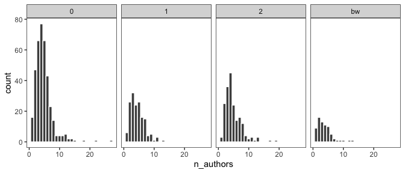

Color-issues in hydrological publications
================

## Data manual

``` r
library(tidyverse)
```

``` r
#read data remotely from github
df <- read_tsv("https://raw.githubusercontent.com/modche/rainbow_hydrology/main/hess_papers_rainbow.txt")
```

    ## 
    ## ── Column specification ────────────────────────────────────────────────────────
    ## cols(
    ##   year = col_double(),
    ##   date = col_date(format = ""),
    ##   title = col_character(),
    ##   authors = col_character(),
    ##   n_authors = col_double(),
    ##   col_code = col_character(),
    ##   volume = col_double(),
    ##   start_page = col_double(),
    ##   end_page = col_double(),
    ##   base_url = col_character(),
    ##   filename = col_character()
    ## )

``` r
str(df)
```

    ## spec_tbl_df [797 × 11] (S3: spec_tbl_df/tbl_df/tbl/data.frame)
    ##  $ year      : num [1:797] 2005 2005 2005 2005 2005 ...
    ##  $ date      : Date[1:797], format: "2005-05-09" "2005-06-09" ...
    ##  $ title     : chr [1:797] "Bringing it all together" "Consumptive water use to feed humanity - curing a blind spot" "Significance of spatial variability in precipitation for process-oriented modelling: results from two nested ca"| __truncated__ "Impact of phosphorus control measures on in-river phosphorus retention associated with point source pollution" ...
    ##  $ authors   : chr [1:797] "J. C. I. Dooge" "M. Falkenmark and M. Lannerstad" "D. Tetzlaff and S. Uhlenbrook" "B. O. L. Demars, D. M. Harper, J.-A. Pitt, and R. Slaughter" ...
    ##  $ n_authors : num [1:797] 1 2 2 4 12 7 2 4 2 2 ...
    ##  $ col_code  : chr [1:797] "bw" "0" "bw" "bw" ...
    ##  $ volume    : num [1:797] 9 9 9 9 9 9 9 9 9 9 ...
    ##  $ start_page: num [1:797] 3 15 29 43 57 67 81 95 111 127 ...
    ##  $ end_page  : num [1:797] 14 28 41 55 66 80 94 109 126 137 ...
    ##  $ base_url  : chr [1:797] "https://hess.copernicus.org/articles/9/3/2005/" "https://hess.copernicus.org/articles/9/15/2005/" "https://hess.copernicus.org/articles/9/29/2005/" "https://hess.copernicus.org/articles/9/43/2005/" ...
    ##  $ filename  : chr [1:797] "hess-9-3-2005.pdf" "hess-9-15-2005.pdf" "hess-9-29-2005.pdf" "hess-9-43-2005.pdf" ...
    ##  - attr(*, "spec")=
    ##   .. cols(
    ##   ..   year = col_double(),
    ##   ..   date = col_date(format = ""),
    ##   ..   title = col_character(),
    ##   ..   authors = col_character(),
    ##   ..   n_authors = col_double(),
    ##   ..   col_code = col_character(),
    ##   ..   volume = col_double(),
    ##   ..   start_page = col_double(),
    ##   ..   end_page = col_double(),
    ##   ..   base_url = col_character(),
    ##   ..   filename = col_character()
    ##   .. )

``` r
head(df)
```

    ## # A tibble: 6 x 11
    ##    year date       title authors n_authors col_code volume start_page end_page
    ##   <dbl> <date>     <chr> <chr>       <dbl> <chr>     <dbl>      <dbl>    <dbl>
    ## 1  2005 2005-05-09 Brin… J. C. …         1 bw            9          3       14
    ## 2  2005 2005-06-09 Cons… M. Fal…         2 0             9         15       28
    ## 3  2005 2005-06-09 Sign… D. Tet…         2 bw            9         29       41
    ## 4  2005 2005-06-14 Impa… B. O. …         4 bw            9         43       55
    ## 5  2005 2005-06-14 Biog… V. R. …        12 bw            9         57       66
    ## 6  2005 2005-06-14 Fact… J. Pem…         7 0             9         67       80
    ## # … with 2 more variables: base_url <chr>, filename <chr>

``` r
tail(df)
```

    ## # A tibble: 6 x 11
    ##    year date       title authors n_authors col_code volume start_page end_page
    ##   <dbl> <date>     <chr> <chr>       <dbl> <chr>     <dbl>      <dbl>    <dbl>
    ## 1  2020 2020-10-23 Hier… Haifan…        11 2            24       4971     4996
    ## 2  2020 2020-10-26 3D m… Valent…         6 2            24       4997     5013
    ## 3  2020 2020-10-28 Aver… Elham …         3 0            24       5015     5025
    ## 4  2020 2020-10-28 Anth… Alex Z…         2 0            24       5027     5041
    ## 5  2020 2020-10-29 Dyna… Jianro…         6 2            24       5043     5056
    ## 6  2020 2020-10-30 Hydr… Xinton…         9 2            24       5057     5076
    ## # … with 2 more variables: base_url <chr>, filename <chr>

### Description of variables in data columns

-   year = year of publication (YYYY)
-   date = date (YYYY-MM-DD) of publication
-   title = full paper title from journal website
-   authors = list of authors comma-separated
-   n\_authors = number of authors (integer between 1 and 27)
-   col\_code = color-issue classification (see below)
-   volume = Journal volume
-   start\_page = first page of paper (consecutive)
-   end\_page = last page of paper (consecutive)
-   base\_url = base url to access the PDF of the paper with
    `/volume/start_page/year/`
-   filename = specific file name of the paper PDF
    (e.g. `hess-9-111-2005.pdf`)

### Explanatory data analysis

Distribution of surveyed papers and 2005, 2010, 2015 and 2020.

``` r
df %>% count(year)
```

    ## # A tibble: 4 x 2
    ##    year     n
    ## * <dbl> <int>
    ## 1  2005    54
    ## 2  2010   191
    ## 3  2015   289
    ## 4  2020   263

Color classification is stored in the `col_code` variable with `0` =
chromatic and issue-free, `1` = red-green issues, `2`= rainbow issues
and `bw`= black and white paper.

``` r
df %>% count(col_code)
```

    ## # A tibble: 4 x 2
    ##   col_code     n
    ## * <chr>    <int>
    ## 1 0          377
    ## 2 1          159
    ## 3 2          190
    ## 4 bw          71

Figure showing number of authors across color classification.

<!-- -->

### PDF access - examples

Data frame can be accessed to extract a vector of links to download
specific papers.

``` r
df %>% filter(year == 2005, start_page == 111) %>% 
    select(base_url, filename) %>% 
    mutate(download_link = paste0(base_url, filename)) %>% 
    pull(download_link)
```

    ## [1] "https://hess.copernicus.org/articles/9/111/2005/hess-9-111-2005.pdf"

``` r
df %>% filter(year == 2005, col_code == "bw", n_authors == 1) %>% 
    select(base_url, filename) %>% 
    mutate(download_link = paste0(base_url, filename)) %>% 
    pull(download_link)
```

    ## [1] "https://hess.copernicus.org/articles/9/3/2005/hess-9-3-2005.pdf"    
    ## [2] "https://hess.copernicus.org/articles/9/481/2005/hess-9-481-2005.pdf"
    ## [3] "https://hess.copernicus.org/articles/9/645/2005/hess-9-645-2005.pdf"
    ## [4] "https://hess.copernicus.org/articles/9/675/2005/hess-9-675-2005.pdf"

``` r
df %>% filter(year == 2020, col_code == 2, n_authors > 10) %>% 
    select(base_url, filename) %>% 
    mutate(download_link = paste0(base_url, filename)) %>% 
    pull(download_link)
```

    ## [1] "https://hess.copernicus.org/articles/24/633/2020/hess-24-633-2020.pdf"  
    ## [2] "https://hess.copernicus.org/articles/24/697/2020/hess-24-697-2020.pdf"  
    ## [3] "https://hess.copernicus.org/articles/24/1485/2020/hess-24-1485-2020.pdf"
    ## [4] "https://hess.copernicus.org/articles/24/3361/2020/hess-24-3361-2020.pdf"
    ## [5] "https://hess.copernicus.org/articles/24/4291/2020/hess-24-4291-2020.pdf"
    ## [6] "https://hess.copernicus.org/articles/24/4971/2020/hess-24-4971-2020.pdf"

### Other possibilities for data analysis:

``` r
df %>% filter(str_detect(string = authors, pattern = "Weiler"))
```

    ## # A tibble: 8 x 11
    ##    year date       title authors n_authors col_code volume start_page end_page
    ##   <dbl> <date>     <chr> <chr>       <dbl> <chr>     <dbl>      <dbl>    <dbl>
    ## 1  2010 2010-07-02 Effe… C. Gas…         3 1            14       1179     1194
    ## 2  2010 2010-08-04 Expl… S. Sto…         2 0            14       1435     1448
    ## 3  2010 2010-08-13 Inte… M. C. …         2 bw           14       1537     1549
    ## 4  2015 2015-03-12 Quan… M. Sta…         3 0            19       1371     1384
    ## 5  2015 2015-06-03 Esti… M. Spr…         4 0            19       2617     2635
    ## 6  2020 2020-02-25 Beyo… Michae…         5 0            24        849      867
    ## 7  2020 2020-05-25 Soil… Mirko …         5 0            24       2633     2653
    ## 8  2020 2020-06-25 Fiel… Anne H…         4 0            24       3271     3288
    ## # … with 2 more variables: base_url <chr>, filename <chr>

``` r
df %>% filter(str_detect(string = title, pattern = "radar"))
```

    ## # A tibble: 12 x 11
    ##     year date       title authors n_authors col_code volume start_page end_page
    ##    <dbl> <date>     <chr> <chr>       <dbl> <chr>     <dbl>      <dbl>    <dbl>
    ##  1  2005 2005-06-09 Sign… D. Tet…         2 bw            9         29       41
    ##  2  2010 2010-01-21 Char… M. Bar…         3 1            14        129      139
    ##  3  2010 2010-02-05 Rela… H. Ste…         4 2            14        193      204
    ##  4  2010 2010-02-05 Perf… C. Z. …         5 2            14        205      221
    ##  5  2015 2015-01-19 Sate… Y. B. …         8 1            19        341      359
    ##  6  2015 2015-03-02 Quan… P. Kle…         3 0            19       1125     1139
    ##  7  2015 2015-03-02 Pola… M. Fre…         2 2            19       1141     1152
    ##  8  2015 2015-03-25 Scop… Y. Dua…         3 2            19       1501     1520
    ##  9  2015 2015-04-29 Eval… O. P. …         2 2            19       2037     2056
    ## 10  2015 2015-09-29 Sing… L.-P. …         4 2            19       4001     4021
    ## 11  2020 2020-03-24 Reco… Nicolá…         4 0            24       1367     1392
    ## 12  2020 2020-06-19 The … Marc S…        10 2            24       3157     3188
    ## # … with 2 more variables: base_url <chr>, filename <chr>

``` r
df %>% filter(end_page > start_page + 30)
```

    ## # A tibble: 4 x 11
    ##    year date       title authors n_authors col_code volume start_page end_page
    ##   <dbl> <date>     <chr> <chr>       <dbl> <chr>     <dbl>      <dbl>    <dbl>
    ## 1  2015 2015-01-15 Hydr… R. G. …         7 1            19        241      273
    ## 2  2020 2020-06-19 The … Marc S…        10 2            24       3157     3188
    ## 3  2020 2020-08-07 Revi… Demetr…         1 1            24       3899     3932
    ## 4  2020 2020-08-25 Pred… Adam K…         6 0            24       4135     4167
    ## # … with 2 more variables: base_url <chr>, filename <chr>
