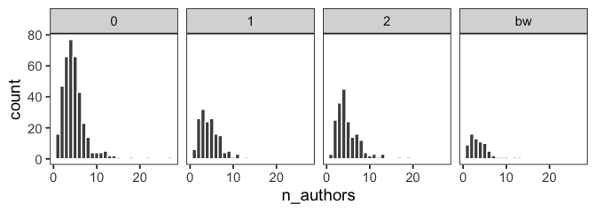

Color-issues in hydrological publications
================

## Load data frame

``` r
library(tidyverse)
```

``` r
#read data remotely from github
df <- read_tsv("https://raw.githubusercontent.com/modche/rainbow_hydrology/main/hess_papers_rainbow.txt")
```

    ## 
    ## ── Column specification ────────────────────────────────────────────────────────
    ## cols(
    ##   year = col_double(),
    ##   date = col_date(format = ""),
    ##   title = col_character(),
    ##   authors = col_character(),
    ##   n_authors = col_double(),
    ##   col_code = col_character(),
    ##   volume = col_double(),
    ##   start_page = col_double(),
    ##   end_page = col_double(),
    ##   base_url = col_character(),
    ##   filename = col_character()
    ## )

## 1. Overwiew data variables

-   year = year of publication (YYYY)
-   date = date (YYYY-MM-DD) of publication
-   title = full paper title from journal website
-   authors = list of authors comma-separated
-   n\_authors = number of authors (integer between 1 and 27)
-   col\_code = color-issue classification (see below)
-   volume = Journal volume
-   start\_page = first page of paper (consecutive)
-   end\_page = last page of paper (consecutive)
-   base\_url = base url to access the PDF of the paper with
    `/volume/start_page/year/`
-   filename = specific file name of the paper PDF
    (e.g. `hess-9-111-2005.pdf`)

``` r
str(df)
```

    ## spec_tbl_df [797 × 11] (S3: spec_tbl_df/tbl_df/tbl/data.frame)
    ##  $ year      : num [1:797] 2005 2005 2005 2005 2005 ...
    ##  $ date      : Date[1:797], format: "2005-05-09" "2005-06-09" ...
    ##  $ title     : chr [1:797] "Bringing it all together" "Consumptive water use to feed humanity - curing a blind spot" "Significance of spatial variability in precipitation for process-oriented modelling: results from two nested ca"| __truncated__ "Impact of phosphorus control measures on in-river phosphorus retention associated with point source pollution" ...
    ##  $ authors   : chr [1:797] "J. C. I. Dooge" "M. Falkenmark and M. Lannerstad" "D. Tetzlaff and S. Uhlenbrook" "B. O. L. Demars, D. M. Harper, J.-A. Pitt, and R. Slaughter" ...
    ##  $ n_authors : num [1:797] 1 2 2 4 12 7 2 4 2 2 ...
    ##  $ col_code  : chr [1:797] "bw" "0" "bw" "bw" ...
    ##  $ volume    : num [1:797] 9 9 9 9 9 9 9 9 9 9 ...
    ##  $ start_page: num [1:797] 3 15 29 43 57 67 81 95 111 127 ...
    ##  $ end_page  : num [1:797] 14 28 41 55 66 80 94 109 126 137 ...
    ##  $ base_url  : chr [1:797] "https://hess.copernicus.org/articles/9/3/2005/" "https://hess.copernicus.org/articles/9/15/2005/" "https://hess.copernicus.org/articles/9/29/2005/" "https://hess.copernicus.org/articles/9/43/2005/" ...
    ##  $ filename  : chr [1:797] "hess-9-3-2005.pdf" "hess-9-15-2005.pdf" "hess-9-29-2005.pdf" "hess-9-43-2005.pdf" ...
    ##  - attr(*, "spec")=
    ##   .. cols(
    ##   ..   year = col_double(),
    ##   ..   date = col_date(format = ""),
    ##   ..   title = col_character(),
    ##   ..   authors = col_character(),
    ##   ..   n_authors = col_double(),
    ##   ..   col_code = col_character(),
    ##   ..   volume = col_double(),
    ##   ..   start_page = col_double(),
    ##   ..   end_page = col_double(),
    ##   ..   base_url = col_character(),
    ##   ..   filename = col_character()
    ##   .. )

``` r
head(df)
```

    ## # A tibble: 6 x 11
    ##    year date       title           authors         n_authors col_code volume
    ##   <dbl> <date>     <chr>           <chr>               <dbl> <chr>     <dbl>
    ## 1  2005 2005-05-09 Bringing it al… J. C. I. Dooge          1 bw            9
    ## 2  2005 2005-06-09 Consumptive wa… M. Falkenmark …         2 0             9
    ## 3  2005 2005-06-09 Significance o… D. Tetzlaff an…         2 bw            9
    ## 4  2005 2005-06-14 Impact of phos… B. O. L. Demar…         4 bw            9
    ## 5  2005 2005-06-14 Biogeochemistr… V. R. Shevchen…        12 bw            9
    ## 6  2005 2005-06-14 Factors influe… J. Pempkowiak,…         7 0             9
    ## # … with 4 more variables: start_page <dbl>, end_page <dbl>, base_url <chr>,
    ## #   filename <chr>

``` r
tail(df)
```

    ## # A tibble: 6 x 11
    ##    year date       title           authors         n_authors col_code volume
    ##   <dbl> <date>     <chr>           <chr>               <dbl> <chr>     <dbl>
    ## 1  2020 2020-10-23 Hierarchical s… Haifan Liu, He…        11 2            24
    ## 2  2020 2020-10-26 3D multiple-po… Valentin Dall'…         6 2            24
    ## 3  2020 2020-10-28 Averaging over… Elham Rouholah…         3 0            24
    ## 4  2020 2020-10-28 Anthropogenic … Alex Zavarsky …         2 0            24
    ## 5  2020 2020-10-29 Dynamic mechan… Jianrong Zhu, …         6 2            24
    ## 6  2020 2020-10-30 Hydrodynamic a… Xintong Li, Bi…         9 2            24
    ## # … with 4 more variables: start_page <dbl>, end_page <dbl>, base_url <chr>,
    ## #   filename <chr>

``` r
skimr::skim(df)
```

|                                                  |      |
|:-------------------------------------------------|:-----|
| Name                                             | df   |
| Number of rows                                   | 797  |
| Number of columns                                | 11   |
| \_\_\_\_\_\_\_\_\_\_\_\_\_\_\_\_\_\_\_\_\_\_\_   |      |
| Column type frequency:                           |      |
| character                                        | 5    |
| Date                                             | 1    |
| numeric                                          | 5    |
| \_\_\_\_\_\_\_\_\_\_\_\_\_\_\_\_\_\_\_\_\_\_\_\_ |      |
| Group variables                                  | None |

Data summary

**Variable type: character**

| skim\_variable | n\_missing | complete\_rate | min | max | empty | n\_unique | whitespace |
|:---------------|-----------:|---------------:|----:|----:|------:|----------:|-----------:|
| title          |          0 |              1 |  24 | 255 |     0 |       797 |          0 |
| authors        |          0 |              1 |   6 | 534 |     0 |       790 |          0 |
| col\_code      |          0 |              1 |   1 |   2 |     0 |         4 |          0 |
| base\_url      |          0 |              1 |  46 |  50 |     0 |       797 |          0 |
| filename       |          0 |              1 |  17 |  21 |     0 |       797 |          0 |

**Variable type: Date**

| skim\_variable | n\_missing | complete\_rate | min        | max        | median     | n\_unique |
|:---------------|-----------:|---------------:|:-----------|:-----------|:-----------|----------:|
| date           |          0 |              1 | 2005-05-09 | 2020-10-30 | 2015-06-08 |       455 |

**Variable type: numeric**

| skim\_variable | n\_missing | complete\_rate |    mean |      sd |   p0 |  p25 |  p50 |  p75 | p100 | hist  |
|:---------------|-----------:|---------------:|--------:|--------:|-----:|-----:|-----:|-----:|-----:|:------|
| year           |          0 |              1 | 2014.77 |    4.58 | 2005 | 2010 | 2015 | 2020 | 2020 | ▂▅▁▇▇ |
| n\_authors     |          0 |              1 |    4.65 |    2.73 |    1 |    3 |    4 |    6 |   27 | ▇▂▁▁▁ |
| volume         |          0 |              1 |   18.77 |    4.58 |    9 |   14 |   19 |   24 |   24 | ▂▅▁▇▇ |
| start\_page    |          0 |              1 | 2077.35 | 1422.75 |    1 |  815 | 1895 | 3189 | 5057 | ▇▆▆▃▃ |
| end\_page      |          0 |              1 | 2092.64 | 1423.50 |   14 |  829 | 1908 | 3209 | 5076 | ▇▆▆▃▃ |

### 2. Explanatory data analysis

Distribution of surveyed papers and 2005, 2010, 2015 and 2020.

``` r
df %>% count(year)
```

    ## # A tibble: 4 x 2
    ##    year     n
    ## * <dbl> <int>
    ## 1  2005    54
    ## 2  2010   191
    ## 3  2015   289
    ## 4  2020   263

Color classification is stored in the `col_code` variable with:

-   `0` = chromatic and issue-free,
-   `1` = red-green issues,
-   `2`= rainbow issues and
-   `bw`= black and white paper.

``` r
df %>% count(col_code)
```

    ## # A tibble: 4 x 2
    ##   col_code     n
    ## * <chr>    <int>
    ## 1 0          377
    ## 2 1          159
    ## 3 2          190
    ## 4 bw          71

Figure showing number of authors across color classification.

<!-- -->

### 3. Access PDF papers with download links

Data frame can be accessed to extract a vector of links to download
specific papers.

**Example:** Access a specific paper from 2005:

``` r
df %>% filter(year == 2005, start_page == 111) %>% 
    select(base_url, filename) %>% 
    mutate(download_link = paste0(base_url, filename)) %>% 
    pull(download_link)
```

    ## [1] "https://hess.copernicus.org/articles/9/111/2005/hess-9-111-2005.pdf"

**Example:** Single-author papers from 2005 that are pure black and
white papers:

``` r
df %>% filter(year == 2005, col_code == "bw", n_authors == 1) %>% 
    select(base_url, filename) %>% 
    mutate(download_link = paste0(base_url, filename)) %>% 
    pull(download_link)
```

    ## [1] "https://hess.copernicus.org/articles/9/3/2005/hess-9-3-2005.pdf"    
    ## [2] "https://hess.copernicus.org/articles/9/481/2005/hess-9-481-2005.pdf"
    ## [3] "https://hess.copernicus.org/articles/9/645/2005/hess-9-645-2005.pdf"
    ## [4] "https://hess.copernicus.org/articles/9/675/2005/hess-9-675-2005.pdf"

**Example**: Rainbow papers from 2020 with more than 10 authors:

``` r
df %>% filter(year == 2020, col_code == 2, n_authors > 10) %>% 
    select(base_url, filename) %>% 
    mutate(download_link = paste0(base_url, filename)) %>% 
    pull(download_link)
```

    ## [1] "https://hess.copernicus.org/articles/24/633/2020/hess-24-633-2020.pdf"  
    ## [2] "https://hess.copernicus.org/articles/24/697/2020/hess-24-697-2020.pdf"  
    ## [3] "https://hess.copernicus.org/articles/24/1485/2020/hess-24-1485-2020.pdf"
    ## [4] "https://hess.copernicus.org/articles/24/3361/2020/hess-24-3361-2020.pdf"
    ## [5] "https://hess.copernicus.org/articles/24/4291/2020/hess-24-4291-2020.pdf"
    ## [6] "https://hess.copernicus.org/articles/24/4971/2020/hess-24-4971-2020.pdf"

### 4. Other possibilities for data analysis:

``` r
df %>% filter(str_detect(string = authors, pattern = "Weiler"))
```

    ## # A tibble: 8 x 11
    ##    year date       title           authors         n_authors col_code volume
    ##   <dbl> <date>     <chr>           <chr>               <dbl> <chr>     <dbl>
    ## 1  2010 2010-07-02 Effect of the … C. Gascuel-Odo…         3 1            14
    ## 2  2010 2010-08-04 Explicit simul… S. Stoll and M…         2 0            14
    ## 3  2010 2010-08-13 Integrated res… M. C. Roa-Garc…         2 bw           14
    ## 4  2015 2015-03-12 Quantifying se… M. Staudinger,…         3 0            19
    ## 5  2015 2015-06-03 Estimating flo… M. Sprenger, T…         4 0            19
    ## 6  2020 2020-02-25 Beyond binary … Michael Stoelz…         5 0            24
    ## 7  2020 2020-05-25 Soil moisture:… Mirko Mälicke,…         5 0            24
    ## 8  2020 2020-06-25 Field observat… Anne Hartmann,…         4 0            24
    ## # … with 4 more variables: start_page <dbl>, end_page <dbl>, base_url <chr>,
    ## #   filename <chr>

``` r
df %>% filter(str_detect(string = title, pattern = "radar"))
```

    ## # A tibble: 12 x 11
    ##     year date       title           authors         n_authors col_code volume
    ##    <dbl> <date>     <chr>           <chr>               <dbl> <chr>     <dbl>
    ##  1  2005 2005-06-09 Significance o… D. Tetzlaff an…         2 bw            9
    ##  2  2010 2010-01-21 Characteristic… M. Barnolas, T…         3 1            14
    ##  3  2010 2010-02-05 Relating surfa… H. Stephen, S.…         4 2            14
    ##  4  2010 2010-02-05 Performance of… C. Z. van de B…         5 2            14
    ##  5  2015 2015-01-19 Satellite rada… Y. B. Sulistio…         8 1            19
    ##  6  2015 2015-03-02 Quantitative h… P. Klenk, S. J…         3 0            19
    ##  7  2015 2015-03-02 Polarimetric r… M. Frech and J…         2 2            19
    ##  8  2015 2015-03-25 Scoping a fiel… Y. Duan, A. M.…         3 2            19
    ##  9  2015 2015-04-29 Evaluation of … O. P. Prat and…         2 2            19
    ## 10  2015 2015-09-29 Singularity-se… L.-P. Wang, S.…         4 2            19
    ## 11  2020 2020-03-24 Reconstructing… Nicolás Velásq…         4 0            24
    ## 12  2020 2020-06-19 The accuracy o… Marc Schleiss,…        10 2            24
    ## # … with 4 more variables: start_page <dbl>, end_page <dbl>, base_url <chr>,
    ## #   filename <chr>

``` r
df %>% filter(end_page > start_page + 30)
```

    ## # A tibble: 4 x 11
    ##    year date       title           authors         n_authors col_code volume
    ##   <dbl> <date>     <chr>           <chr>               <dbl> <chr>     <dbl>
    ## 1  2015 2015-01-15 Hydrometeorolo… R. G. Knox, M.…         7 1            19
    ## 2  2020 2020-06-19 The accuracy o… Marc Schleiss,…        10 2            24
    ## 3  2020 2020-08-07 Revisiting the… Demetris Kouts…         1 1            24
    ## 4  2020 2020-08-25 Predicting dis… Adam Kiczko, K…         6 0            24
    ## # … with 4 more variables: start_page <dbl>, end_page <dbl>, base_url <chr>,
    ## #   filename <chr>
